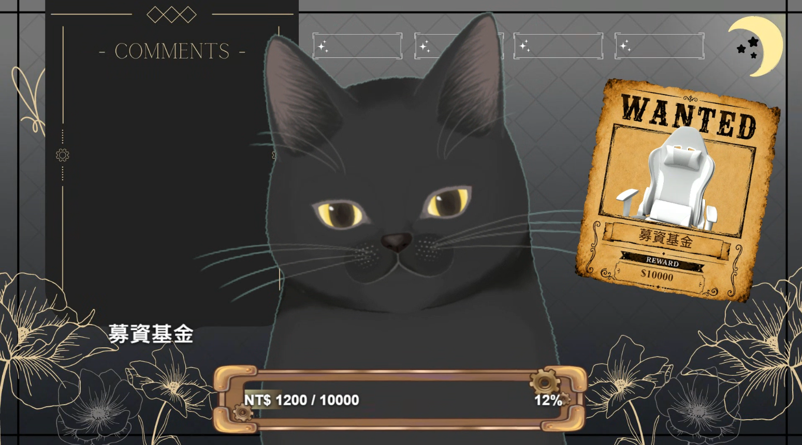
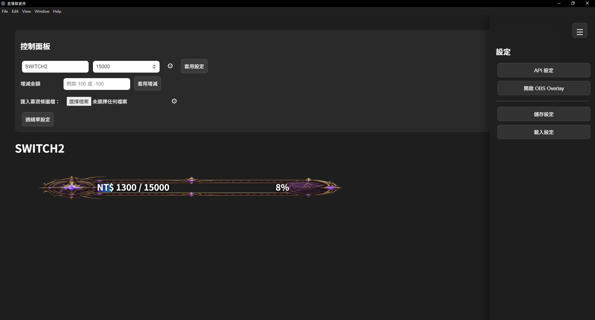
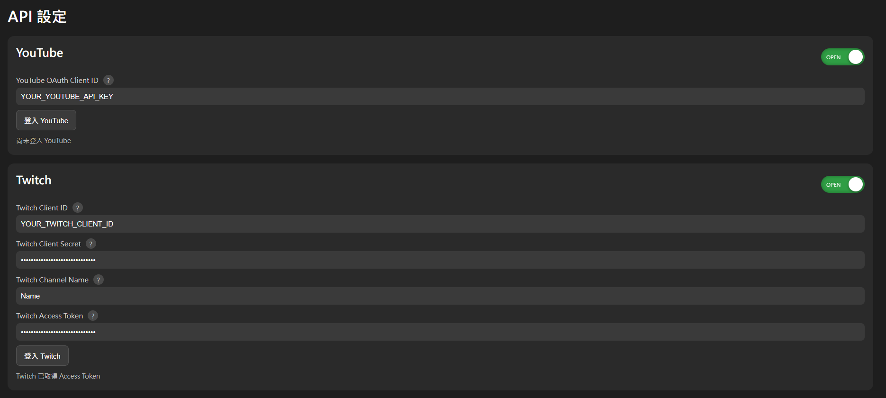
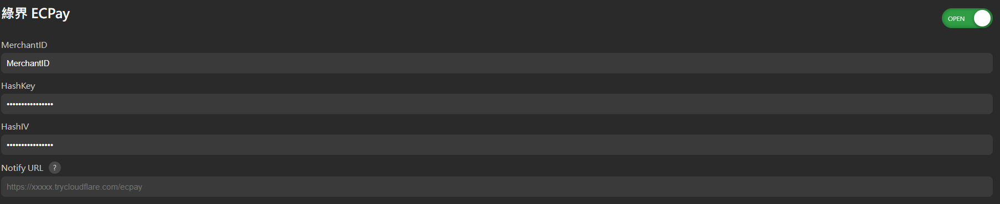

# Live Donation Bar

An Electron-based donation overlay application designed for live streamers and content creators.

---

## Project Overview

Live Donation Bar is a desktop application developed to provide real-time donation tracking and visualization for livestreams.

The system supports YouTube, Twitch, and ECPay integration, allowing donations from multiple platforms to be synchronized into a single customizable donation progress bar.

The project was independently designed and developed, including:

- UI/UX Design
- Electron Desktop Application Development
- API Integration
- Local HTTP Server Implementation
- OBS Browser Source Integration
- Cloudflare Tunnel Deployment
- Software Packaging and Distribution

---

## Screenshots

### OBS Overlay

Final donation overlay displayed in OBS Browser Source.



---

### Control Panel

Main application interface used to configure donation goals, themes, fonts, colors, and overlay settings.



---

### API Settings (YouTube / Twitch)

Configuration interface for YouTube and Twitch integration.



---

### API Settings (ECPay)

Configuration interface for ECPay payment integration and webhook setup.



---

## Key Features

### Donation Platform Integration

- YouTube donation integration
- Twitch donation integration
- ECPay payment integration
- Real-time donation synchronization

### OBS Overlay Support

- OBS Browser Source integration
- Real-time progress updates
- Custom donation bar themes
- Horizontal and vertical layouts

### Customization Features

- Custom donation bar skins
- Adjustable colors and gradients
- Custom fonts and text styles
- Flexible positioning and scaling

### Software Engineering

- Electron desktop application
- Local HTTP server implementation
- Cloudflare Tunnel support
- Configuration persistence
- Real-time overlay rendering

---

## System Architecture

```text
YouTube API
      │
      ▼
Live Donation Bar
      ▲
      │
Twitch API

      │

      ▼

Local HTTP Server
      │
      ▼
OBS Browser Source

      ▲
      │

ECPay Payment Gateway
```

---

## Technologies

- Electron
- Node.js
- JavaScript
- HTML5
- CSS3
- Express.js
- YouTube Data API
- Twitch API
- ECPay Payment API
- OBS Browser Source
- Cloudflare Tunnel

---

## Development Highlights

### Real-World Application

This project was developed to solve practical donation tracking requirements for livestreaming environments.

### API Integration

Integrated multiple third-party platforms into a unified donation tracking system.

### Desktop Software Development

Built using Electron to provide a standalone desktop application experience.

### Overlay System

Implemented real-time synchronization between the desktop application and OBS Browser Source overlays.

### Payment Integration

Integrated ECPay payment notifications and automated donation updates through webhook mechanisms.

---

## Future Improvements

- Additional donation platform support
- More advanced overlay customization
- Cloud synchronization
- Multi-user profile management
- Analytics dashboard

---

## Status

Source code is private.

This repository is maintained as a portfolio showcase demonstrating software engineering, API integration, and livestream tool development capabilities.
